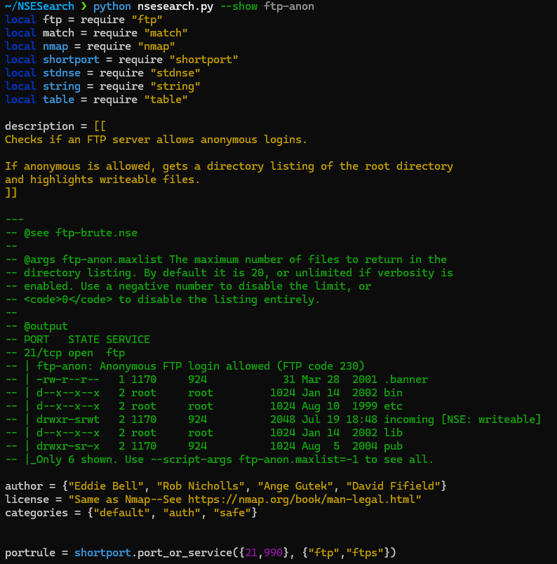

```
 __    __   ______   ________   ______                                           __       
|  \  |  \ /      \ |        \ /      \                                         |  \      
| $$\ | $$|  $$$$$$\| $$$$$$$$|  $$$$$$\  ______    ______    ______    _______ | $$____  
| $$$\| $$| $$___\$$| $$__    | $$___\$$ /      \  |      \  /      \  /       \| $$    \ 
| $$$$\ $$ \$$    \ | $$  \    \$$    \ |  $$$$$$\  \$$$$$$\|  $$$$$$\|  $$$$$$$| $$$$$$$\
| $$\$$ $$ _\$$$$$$\| $$$$$    _\$$$$$$\| $$    $$ /      $$| $$   \$$| $$      | $$  | $$
| $$ \$$$$|  \__| $$| $$_____ |  \__| $$| $$$$$$$$|  $$$$$$$| $$      | $$_____ | $$  | $$
| $$  \$$$ \$$    $$| $$     \ \$$    $$ \$$     \ \$$    $$| $$       \$$     \| $$  | $$
 \$$   \$$  \$$$$$$  \$$$$$$$$  \$$$$$$   \$$$$$$$  \$$$$$$$ \$$        \$$$$$$$ \$$   \$$                                                                                     
```

**A fast, offline search and discovery tool for Nmap NSE scripts.**

[](https://github.com/haydena23/nsesearch)
[](https://opensource.org/licenses/MIT)
[](https://www.python.org/downloads/)
[](https://github.com/haydena23/nsesearch/stargazers)

`nsesearch` is a powerful command-line utility that indexes all Nmap Scripting Engine (NSE) scripts on your local machine, allowing you to find the exact script you need in seconds. No more browsing the web. Search by name, category, description, author, port hints, and more, then immediately view, diff, or generate an `nmap` command to run your findings.

---

## Key Features

-   **⚡ Blazing Fast & Offline:** Searches a pre-built JSON index for instant results.
-   **🎯 Advanced Search:** Query by name, description, category, author, port, or service. Combine terms with `AND`/`OR` logic and use regex for complex searches.
-   **🎨 Rich Output:**
    -   View results in clean, auto-sizing tables.
    -   Export to **JSON, YAML, CSV, TSV, XML,** or **NDJSON** for scripting.
    -   Colorized terminal output highlights your search terms.
-   **🔎 Script Inspection:**
    -   Display any script's full source code with **Lua syntax highlighting**.
    -   Show a script's dependencies (`require` statements).
    -   **Diff** two scripts directly from the command line.
-   **🚀 Nmap Integration:**
    -   Instantly **generate `nmap` commands** with the correct `--script` and `-p` arguments.
    -   Directly **execute `nmap` commands** against a target.
-   **⚙️ Simple & Portable:** Single Python script with no external dependencies required.

## Installation

`nsesearch.py` is a single script and requires only Python 3.6+.

1.  **Clone the repository:**
    ```bash
    git clone https://github.com/haydena23/nsesearch.git
    cd nsesearch
    ```

2.  **Make the script executable:**
    ```bash
    chmod +x nsesearch.py
    ```

3.  **Create a symbolic link** for easy access from anywhere (recommended):
    ```bash
    sudo ln -s "$(pwd)/nsesearch.py" /usr/local/bin/nsesearch
    ```
    Now you can just run `nsesearch` instead of `./nsesearch.py`.

## First-Time Setup: Build the Index

Before you can search, you need to create the script index. This is a one-time step. `nsesearch` will automatically find scripts in common Nmap installation directories.

```bash
nsesearch --update
```
This command scans your system, parses all `.nse` files, and saves the metadata to `~/.cache/nsesearch/index.json`. Run this command again whenever you update Nmap or add new custom scripts.

## Usage & Examples

### 1. Basic Search

Search terms are combined with `AND`. Use `OR` for alternative terms.

```bash
# Find scripts related to both http and wordpress
nsesearch http wordpress

# Find scripts for either SMB or SQL brute-forcing
nsesearch "smb brute OR sql brute"
```

### 2. Filtering

Narrow your search with powerful filters.

```bash
# Find all vulnerability scripts for the http service
nsesearch -c vuln --service http

# Find scripts by a specific author, excluding any that are "intrusive"
nsesearch -a "Paulino Calderon" -e intrusive

# Find scripts that might run on web servers
nsesearch --port 80,443,8080
```

### 3. Using Regex

For highly specific patterns, use the `--regex` flag.

```bash
# Find scripts with "backdoor" in their name or description (case-insensitive)
nsesearch -r "backdoor"

# Find scripts matching a specific Microsoft vulnerability pattern
nsesearch -r "ms[0-9]{2}-[0-9]{3}"
```

### 4. Viewing Script Content

Found a script? View its source code with syntax highlighting right in your terminal.

```bash
nsesearch --show http-title
```

 <!-- Example screenshot -->

### 5. Generating & Running Nmap Commands

This is where `nsesearch` truly shines. Find scripts and immediately put them to use.

```bash
# 1. Find all "safe" discovery scripts
# 2. Generate an nmap command to run them against a target
nsesearch -c discovery,safe --run 192.168.1.1

# Output:
# nmap --script afp-serverinfo,banner,... --script-args <...args> 192.168.1.1

# Or, execute the command directly and see the nmap output
nsesearch -c vuln --service http --port 80 --exec scanme.nmap.org
```

### 6. Changing Output Format

Pipe search results into other tools by changing the output format.

```bash
# Get results as JSON
nsesearch http-vuln --format json

# Get just the file paths, one per line (table is the default)
nsesearch --paths-only http-enum
```

**JSON Example:**
```json
[
  {
    "Script": "http-vuln-cve2017-5638",
    "Categories": "exploit,vuln",
    "Description": "Exploits Apache Struts RCE vulnerability CVE-2017-5638.",
    "Path": "/usr/share/nmap/scripts/http-vuln-cve2017-5638.nse"
  }
]
```

### 7. Listing Categories

See all available script categories and how many scripts are in each.

```bash
nsesearch --list-categories
```

<details>
<summary><b>► Click to see all Command-Line Options</b></summary>

```text
usage: nsesearch.py [-h]
                    [--update | --show SHOW | --copy COPY | --list-categories | --run TARGET | --exec TARGET | --diff SCRIPT1 SCRIPT2]
                    [-r REGEX] [-x] [-c CATEGORIES] [-e EXCLUDE_CATEGORIES]
                    [-a AUTHORS] [-A EXCLUDE_AUTHORS] [-s SERVICE] [-P PORT]
                    [-p] [--deps] [-d DIRS] [--script-args SCRIPT_ARGS]
                    [--ports PORTS] [--sort-by {name,updated,category}]
                    [--format {table,json,yaml,ndjson,csv,tsv,xml}]
                    [--color {auto,always,never}] [--no-color] [--out FILE]
                    [--append] [--quiet] [--name-only] [--case-sensitive]
                    [--verbose] [--version]
                    [query ...]

NSE Search is a fast, offline indexer & searcher for Nmap NSE scripts.
Find scripts by name, description, category, author, args, references,
services, or ports; filter safely with exact/regex; colorize matches;
export in table, JSON, YAML, CSV/TSV, XML, or NDJSON; diff scripts;
and generate/run nmap commands.

Made by: Tony Hayden  |  Version: 1.0.2  |  GitHub: http://github.com/haydena23

positional arguments:
  query                 Search terms (space = AND, use OR for alternatives,
                        e.g., 'http brute')

options:
  -h, --help            show this help message and exit
  --update              Rebuild the index now
  --show SHOW           Show a script's contents with syntax highlighting (by
                        name or path)
  --copy COPY           Copy a script to the current directory (by name or
                        path)
  --list-categories     List all categories with descriptions and counts
  --run TARGET          Print an nmap command to run matching scripts against
                        TARGET
  --exec TARGET         Run an nmap command for matching scripts against
                        TARGET
  --diff SCRIPT1 SCRIPT2
                        Diff two scripts with colorized output (by name or
                        path)
  -r REGEX, --regex REGEX
                        Regex search across
                        name/desc/cats/authors/args/refs/deps
  -x, --exact           Exact word match for query terms
  -c CATEGORIES, --categories CATEGORIES
                        Filter by categories (comma-separated)
  -e EXCLUDE_CATEGORIES, --exclude-categories EXCLUDE_CATEGORIES
                        Exclude categories (comma-separated)
  -a AUTHORS, --authors AUTHORS
                        Filter by authors (comma-separated)
  -A EXCLUDE_AUTHORS, --exclude-authors EXCLUDE_AUTHORS
                        Exclude authors (comma-separated)
  -s SERVICE, --service SERVICE
                        Filter by service hints (comma-separated, e.g.,
                        http,ssl)
  -P PORT, --port PORT  Filter by port hints (comma-separated, e.g., 80,443)
  -p, --paths-only      Print only file paths
  --deps                Show script dependencies instead of full details
  -d DIRS, --dirs DIRS  Additional directories to scan (OS-path-separated)
  --script-args SCRIPT_ARGS
                        Arguments to pass to --script-args when using --run
                        /--exec
  --ports PORTS         Ports for nmap -p when using --run/--exec (e.g.,
                        80,443 or 1-1024)
  --sort-by {name,updated,category}
                        Sort results by field
  --format {table,json,yaml,ndjson,csv,tsv,xml}
                        Select output format
  --color {auto,always,never}
                        Colorize matches in output (default: auto)
  --no-color            Disable colored output (alias for --color=never)
  --out FILE            Write output to FILE instead of stdout
  --append              Append to FILE when used with --out
  --quiet               Suppress status messages
  --name-only           Limit matching to script names only
  --case-sensitive      Make matching case-sensitive (affects -x, terms, and
                        regex)
  --verbose             Print debug info (index stats, parsed metadata)
  --version             show program's version number and exit
```

</details>

## Changelog

Changes can also be found in the [CHANGELOG](CHANGELOG.md) file.

<details>
<summary>v1.0.2</summary>

# **v1.0.2**

This update focuses on adding powerful new features for script analysis, improving search capabilities, enhancing output formatting, and increasing overall robustness and user experience.

#### ✨ **New Features**

*   **Advanced Search with OR Logic**: The search query now supports `OR` operators, allowing for more complex and flexible searches (e.g., `"http brute OR smb brute"`).
*   **Exclusion Filters**: You can now exclude specific categories and authors from your search results using the new `--exclude-categories` and `--exclude-authors` flags.
*   **Service and Port Filtering**: Added `--service` and `--port` filters to find scripts relevant to specific network services or port numbers.
*   **Dependency Analysis**: The script now parses and indexes script dependencies (`require` statements). You can view these with the new `--deps` flag.
*   **Script Diffing**: A `--diff` command has been added to compare two NSE scripts (by name or path) and view a colorized, unified diff directly in your terminal.
*   **Direct Nmap Execution**: In addition to generating a command with `--run`, you can now execute it directly using the `--exec` flag.
*   **Lua Syntax Highlighting**: The `--show` command now features full Lua syntax highlighting for improved readability.
*   **Configuration File Support**: The script now looks for a configuration file at `~/.config/nsesearchrc.json` to load default script directories and output formats.
*   **Sorting Options**: You can now sort search results by name, last update time, or category using the `--sort-by` flag.

####  Improvements

*   **More Robust Indexing**:
    *   The index now stores a hash of each script's content to detect changes more reliably.
    *   Added a timeout to the file search to prevent hangs on unusually large or problematic directories.
    *   The index will automatically rebuild if the script directories have changed since the last build.
*   **Enhanced Output Formatting**:
    *   Table rendering is now more adaptive to different terminal widths, improving readability on both wide and narrow screens.
    *   Structured formats (JSON, YAML, etc.) now support optional color highlighting when the `--color=always` flag is used.
    *   Improved HTML parsing to preserve content within `<code>` tags as backticks.
*   **Improved User Experience**:
    *   The command-line interface now has mutually exclusive groups for actions like `--update`, `--show`, `--run`, etc., making it clearer and less error-prone.
    *   Running the script with no arguments now displays a helpful usage tip instead of the full help menu.
    *   Added more detailed warnings for invalid port ranges or misuse of command-line arguments.
*   **Code and Dependency Updates**:
    *   The script now uses `shlex.join` for safer command string construction.
    *   Dependencies like `difflib` and `subprocess` have been added to support the new diffing and execution features.
    *   Internal data models have been updated to include script dependencies and content hashes.

#### 🐞 **Bug Fixes**

*   Corrected an issue where the author parsing logic could fail on complex, nested Lua tables.
*   Improved the accuracy of service and port hint extraction from `shortport.service()` calls.
*   Ensured consistent handling of file paths and encodings, especially on different operating systems.
*   Fixed a command injection vulnerability when `build_nmap_command` constructs a list of arguments, not sanitizing input before passing to `subprocess.run`

***
</details>

## Contributing

Contributions are welcome! If you have a feature request, bug report, or want to improve the code:

1.  Check for existing issues.
2.  Fork the repository.
3.  Create a new branch for your feature or fix.
4.  Submit a pull request with a clear description of your changes.

## License

This project is licensed under the MIT License. See the [LICENSE](LICENSE) file for details.